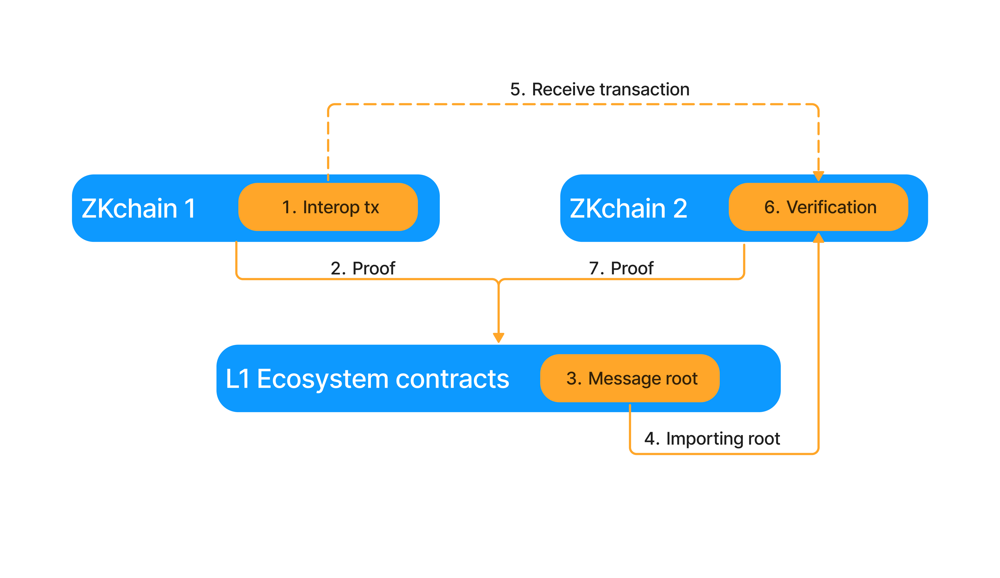

# Interop overview
[back to readme](../README.md)

### Interop process

The interop process consists of seven main steps:

1. Initiating the Transaction on the Sending Chain

   - The user/calls calls the InteropCenter contract. For example if they want to use a bridge an asset they might call
     `requestL2TransactionSingleCall`. Read the [InteropCenter](./interop_center.md) for more information.
   - The InteropCenter emits two `InteropBundleSent` and single `InteropTriggerSent` events. This events together specify the interop tx.
     This event data can be gathered to create the interop txs.
   - For each event an L2->L1 message, it is included in the chains merkle tree of emitted txs in the `L2toL1Logs` merkle tree, see [here](./forms_of_finality.md).

2. Settlement of Receiving chain on the Settlement Layer (SL)
   - The chain submits its proof to its settlement layer (L1 or Gateway).

3. Updating the MessageRoot on the Settlement Layer

   - The MessageRoot contract is updated with new data from the settling chain as it settles.
   - This update includes all L2toL1Logs emitted from the settling chain.

4. The Receiving Chain Fetches the Updated MessageRoot
    - The receiving chain retrieves the updated `MessgeRoot` from the Settlement Layer. 
    - Note: alternative hashes might be imported here, see [here](./forms_of_finality.md) for more details.

5. Submitting Cross-L2 Transactions on the Destination Chain

    - The interop transactions (xL2 txs) can now be submitted to the destination chain.
    - To automatically process the transaction, Merkle proofs for the two bundles and the trigger are required.
    - Individual bundles can also be processed manually (e.g., by providing the necessary gas). 

6. Verifying and Executing the Interop Transaction 
    - The interop tx is verified and executed on the destination chain using the `InteropHandler` contract. 
    - the interop txs is verified. This means the merkle proofs are checked agains the MessageRoot.
    - After this the bundles can be executed. The bundle hash is stored in the InteropHandler contract, so that the bundle cannot be
      replayed.

7. Settling of the Destination Chain
    - The destination chain settles on the Settlement Layer (SL).
    - It verifies that the imported MessageRoot matches expectations.
